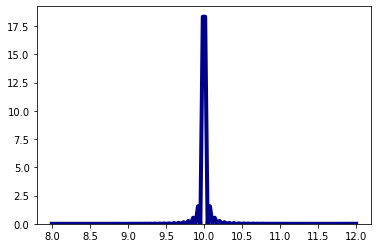
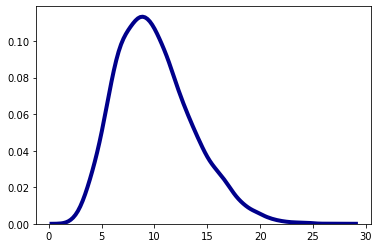

# Agent-based social simulation (Python)

## "The Inescapable Casino"

This simulation is based on (Boghosian 2019) **"The Inescapable Casino"**. 

**Bruce M. Boghosian** is a professor of mathematics at Tufts University, with research interests in applied dynamical systems and applied probability theory.

Read it here: https://www.scientificamerican.com/article/is-inequality-inevitable/

**Parameters**

You can play with the simulation changing following parameters:

* population = 10000
* iterations = 10000000
* iter_plot =  100000
* init_v = 10.0
* win_rate = 0.2
* loss_rate = 0.1 # 0.17

By playing with those parameters (explained in the Boghosian article) you can see how 'wealth' distribution is changing over time.

**Iteration: 1**

**Iteration: 100000**
     

### References:

Boghosian B. M. (2019). "The Inescapable Casino" in Scientific American 321, 5, 70-77 (November 2019) doi:10.1038/scientificamerican1119-70
